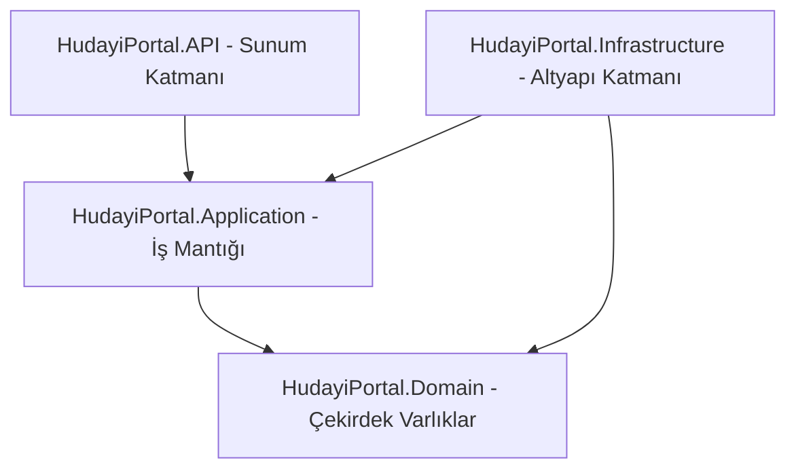

# HudayiPortal Portal Altyapısı: Mimari ve Teknoloji Analiz Raporu

Bu doküman, HudayiPortal Clean Architecture projesi kapsamında backend (C# - .NET 8) ve frontend (React - TypeScript - MUI) katmanlarında gerçekleştirilen kapsamlı mimari dönüşümleri, entegre edilen kurumsal (enterprise) teknolojileri, güvenlik protokollerini ve gözlemlenebilirlik (observability) altyapılarını teknik ve akademik standartlarda analiz etmektedir.

---

## 1. Giriş ve Temiz Mimari (Clean Architecture) Özeti

Yazılım geliştirme süreçlerinde sürdürülebilirlik, test edilebilirlik, teknoloji bağımsızlığı ve ölçeklenebilirlik sağlamanın en olgun yollarından biri **Temiz Mimari (Clean Architecture)** şablonudur. Projemizde uygulanan mimari model, bağımlılıkların içe doğru (Domain katmanına doğru) yöneldiği, iş kurallarının dış etkenlerden (veritabanı, arayüz, loglama kütüphaneleri vb.) tamamen izole edildiği bir yapı sunar.



### Katmanlar Arası Sorumluluk Ayrımı (Separation of Concerns)

1. **Domain (Çekirdek Varlıklar Katmanı):** Projenin en içteki kalbidir. Hiçbir dış kütüphaneye veya katmana bağımlılığı yoktur. Veritabanı tablolarına karşılık gelen temel varlık sınıflarını (örn. `Sikayet`, `MaliIslem`, `GunlukYoklama`, `Kullanici`), Value Object'leri ve iş kurallarının özünü barındırır.
2. **Application (İş Mantığı Katmanı):** Uygulamanın tüm kullanım senaryolarını (Use Cases) yönetir. Dış katmanların servislerine ait arayüz tanımlamaları (Interfaces), DTO'lar, validatorlar ve CQRS komut/sorgu işleyicileri bu katmandadır. **MediatR** kütüphanesi aracılığıyla gevşek bağlılık (loose coupling) ilkesi uygulanarak bağımlılıklar asgari düzeye indirgenmiştir.
3. **Infrastructure (Altyapı Katmanı):** Uygulamanın dış dünya ile etkileşim kuran teknik çözümlerini barındırır. Veritabanı erişim teknolojileri (Entity Framework Core, Unit of Work, Repository implementasyonları), önbellekleme servisleri (Redis Cache), kimlik doğrulama mekanizmaları, SignalR Hub tanımlamaları ve SMTP e-posta gönderme altyapıları bu katmanda somutlaştırılır.
4. **Presentation / API (Sunum Katmanı - HudayiPortal.API):** HTTP isteklerini kabul eden ve istemciye (React frontend) yanıt üreten katmandır. ASP.NET Core Web API mimarisine sahiptir. İstemci yetkilendirmeleri (JWT Bearer Token), küresel hata yakalama ara katmanları (Global Exception Handler) ve API Controller sınıfları bu katmanda yer almaktadır.
5. **Frontend Katmanı (React - TanStack Query - MUI):** Kullanıcı deneyiminin (UX) sunulduğu, sunucu durumunu (server-state) senkronize eden, responsive ve zengin görsel bileşenlere sahip modern arayüz katmanıdır.

---

## 2. Teknolojik Katmanlar ve Projedeki Tam Karşılıkları

### A. SignalR (Real-Time Communication / Gerçek Zamanlı İletişim)

#### Nedir?
SignalR, ASP.NET Core uygulamalarına çift yönlü, anlık ve gerçek zamanlı web tabanlı iletişim (Real-Time Communication) kabiliyeti kazandıran açık kaynaklı bir kütüphanedir. Geleneksel HTTP modelindeki "istek-yanıt" (request-response) kısıtlamasını aşarak, sunucunun istemciye (server-to-client push) anında veri göndermesine olanak tanır. SignalR; WebSocket, Server-Sent Events ve Long Polling protokollerini otomatik olarak yöneterek istemci tarayıcısının desteklediği en optimize kanalı seçer.

#### Projemizde Nerede, Hangi Senaryoda ve Niçin Kullanıldı?
* **Konum:** [ChatHub.cs](file:///c:/Users/ASUS/Desktop/anti_project/HudayiPortal-master/HudayiPortal.Infrastructure/Hubs/ChatHub.cs) ve [SignalRContext.tsx](file:///c:/Users/ASUS/Desktop/anti_project/HudayiPortal-Client-main/src/context/SignalRContext.tsx).
* **Güvenli JWT Bağlantısı:** SignalR WebSocket isteklerinde tarayıcı kısıtlamaları nedeniyle standart HTTP Header'larında JWT Token gönderilemediğinden, `Program.cs` altındaki `OnMessageReceived` eventi ile bağlantı URL'sindeki `access_token` query parametresi yakalanmış ve SignalR bağlantısı güvenli hale getirilmiştir.
* **Otomatik Grup Katılımı (OnConnectedAsync):** Bir kullanıcı sohbete bağlandığı an, `ChatHub.cs` içerisindeki `OnConnectedAsync` metodu tetiklenir. Kullanıcının dahil olduğu tüm aktif sohbet grupları ve dahil olduğu ikili mesajlaşma (DM) odaları `ChatGrupUyeleri` tablosundan sorgulanır. Kullanıcı, SignalR'ın `Groups.AddToGroupAsync` metoduyla ilgili odalara otomatik olarak atanır.
* **DM ve Teams Tarzı Çoklu Sohbet Akışı:** Bir kullanıcı mesaj gönderdiğinde (`POST /api/chat/messages`), backend bu mesajı veritabanına kaydeder ve ardından SignalR aracılığıyla ilgili grubun odasına (`Clients.Group(groupId.ToString()).SendAsync(...)`) anlık olarak fırlatır. Alıcı kullanıcılar sayfayı yenilemek zorunda kalmadan mesajı anında ekranlarında dairesel mesaj balonları halinde görürler.

---

### B. Redis Caching (Distributed Cache & TTL / Dağıtık Önbellekleme)

#### Nedir?
Redis (Remote Dictionary Server), verileri disk yerine bilgisayar belleğinde (RAM) anahtar-değer (key-value) formatında tutan, son derece hızlı, açık kaynaklı bir bellek içi (in-memory) veri yapısı deposudur. Dağıtık mimarilerde birden fazla uygulama sunucusunun ortak ve tutarlı bir önbelleği paylaşmasını sağlar. RAM üzerinde çalıştığı için okuma ve yazma gecikmeleri milisaniyeler seviyesindedir.

#### Projemizde Nerede, Hangi Senaryoda ve Niçin Kullanıldı?
Projemizde Redis, iş kurallarının ve veri tiplerinin doğasına göre iki temel strateji ile entegre edilmiştir. Ayrıca, Redis sunucusunun kesintiye uğraması durumuna karşı `RedisCacheService` içinde otomatik olarak bellek içi (`IMemoryCache`) önbelleğe geçiş yapan bir **Fail-safe Fallback** mekanizması kurulmuştur.

```
                  ┌───────────────────────────────┐
                  │      API / CQRS Handler       │
                  └───────────────┬───────────────┘
                                  │
                  ┌───────────────▼───────────────┐
                  │       ICacheService           │
                  └───────────────┬───────────────┘
                                  │
                ┌─────────────────┴─────────────────┐
       Redis Aktif mi?                    Redis Kapalı mı?
        (Evet ise)                          (Hayır ise)
     ┌──────────┴──────────┐             ┌──────────┴──────────┐
     │  RedisCacheService  │             │  InMemory Cache     │
     │   (Distributed)     │             │     (Fallback)      │
     └─────────────────────┘             └─────────────────────┘
```

#### 1. Strateji: Cache-Aside / Read-Through (Duyurular & Yemek Menüsü)
* **Kullanım Yeri:** `GetActiveDuyurularQueryHandler` ve `GetYemekMenusuQueryHandler` sınıfları.
* **Senaryo:** Sıkça sorgulanan ancak seyrek güncellenen veriler (Öğrenci duyuruları, haftalık/aylık yemek menüsü) için kullanılır. Sorgu tetiklendiğinde önce Redis önbelleğine `"duyurular:aktif"` veya `"yemek:menu:{yil}:{ay}"` anahtarlarıyla bakılır. Cache'te veri varsa (cache hit), veritabanına gidilmeden doğrudan RAM'den çekilerek milisaniyeler içinde istemciye dönülür. Cache'te veri yoksa (cache miss), SQL veritabanından sorgulanır, Redis'e **1 saatlik (3600 sn)** absolute expiration süresiyle yazılır ve istemciye iletilir.
* **Önbellek Temizleme (Cache Invalidation):** Veri tutarlılığını garanti etmek amacıyla, yeni bir duyuru eklendiğinde (`CreateDuyuruCommand`), güncellendiğinde (`UpdateDuyuruCommand`) veya silindiğinde (`DeleteDuyuruCommand`) ilgili cache anahtarları `ICacheService.RemoveAsync` ile anında bellekten kazınır. Böylece kullanıcılar her zaman en güncel veriyi görürler.

#### 2. Strateji: Kısa Süreli Geçici Veri Deposu (Mail OTP - Tek Kullanımlık Şifre)
* **Kullanım Yeri:** `GenerateOTPCommand` ve `VerifyOTPCommand` işleyicileri.
* **Senaryo:** E-posta doğrulama veya şifre sıfırlama işlemlerinde üretilen 6 haneli kritik OTP kodlarının yönetimidir. Bu geçici ve hassas verilerin ilişkisel veritabanını (SQL) gereksiz I/O işlemleriyle yormasını engellemek ve güvenlik seviyesini artırmak için Redis tercih edilmiştir.
* **TTL (Time-To-Live) Gücü:** Üretilen OTP kodu, Redis üzerinde `otp:{Email}` anahtarıyla ve tam **3 dakikalık (180 saniye)** bir yaşam süresiyle kaydedilir. Redis, TTL süresi dolduğu an bu kodu RAM'den otomatik ve kalıcı olarak temizler.
* **Doğrulama ve İmha:** Kullanıcı 6 haneli kodu girdiğinde doğrulama doğrudan Redis üzerinden yapılır. Kod doğru ise, ikinci kez kullanılmasını (replay attack) önlemek amacıyla `RemoveAsync` metodu ile bellekten anında silinir.

---

### C. TanStack Query / React Query (Frontend Server-State Yönetimi)

#### Nedir?
TanStack Query, React tabanlı web uygulamalarında sunucu durumunu (server-state) yönetmek, önbelleğe almak, senkronize etmek ve güncellemek için tasarlanmış güçlü bir durum yönetimi (state management) kütüphanesidir. Redux veya Context API gibi yerel durum yönetimi araçlarının aksine, asenkron sunucu isteklerinin durumunu (loading, error, caching, background refetching) otomatik ve deklaratif bir yapıda kontrol eder.

#### Projemizde Nerede, Hangi Senaryoda ve Niçin Kullanıldı?
* **Konum:** [ChatPage.tsx](file:///c:/Users/ASUS/Desktop/anti_project/HudayiPortal-Client-main/src/pages/Chat/ChatPage.tsx) ve API çağrılarının yapıldığı tüm React bileşenleri.
* **İstek Optimizasyonu:** Sohbet listesi ve mesaj geçmişi verileri TanStack Query ile önbelleğe alınmıştır. Kullanıcı farklı sohbetlere tıkladığında daha önce yüklenmiş mesajlar anında ekrana gelir, arka planda ise veriler sessizce güncellenir (stale-while-revalidate).
* **SignalR & Optimistic UI Güncellemeleri:** En kritik senaryolardan biri, SignalR üzerinden yeni bir mesaj geldiğinde yaşanmaktadır. İstemci tarayıcısına SignalR aracılığıyla anlık bir `ReceiveMessage` olayı ulaştığında, React istemcisinin sunucuya yeni bir HTTP `GET` isteği atarak tüm mesaj listesini tekrar çekmesi (polling/fetching) engellenmiştir.
* **queryClient.setQueryData:** SignalRContext içerisinde TanStack Query'nin `queryClient.setQueryData` metodu kullanılarak yerel önbellek (cache) manuel olarak manipüle edilir. Gelen yeni mesaj nesnesi, mesaj geçmişi önbellek dizisinin sonuna anında eklenir. Benzer şekilde, sol paneldeki sohbet listesinde ilgili sohbetin "son mesajı" güncellenir ve sohbet listesinde en üste taşınır. Bu sayede kullanıcıya pürüzsüz, sıfır gecikmeli (Optimistic UI) ve son derece modern bir anlık mesajlaşma deneyimi sunulmuştur.

---

### D. IDOR Güvenlik Duvarı (Insecure Direct Object Reference Prevention)

#### Nedir?
IDOR (Güvenli Olmayan Doğrudan Nesne Başvurusu), bir saldırganın veya kullanıcının istek parametrelerini (örneğin URL'deki ID bilgisini veya JSON gövdesindeki ID alanını) değiştirerek, kendisine ait olmayan hassas verilere (fatura, şikayet, izin talebi vb.) doğrudan erişim sağlayabildiği kritik bir web güvenlik açığıdır. Bu açık, sunucu tarafında istek sahibinin kimliği ile erişilmek istenen kaynağın sahipliği arasında yeterli kontrol yapılmadığında ortaya çıkar.

#### Projemizde Nerede, Hangi Senaryoda ve Niçin Kullanıldı?
HudayiPortal projesinde veri güvenliğini kurumsal standartlara taşımak için iki aşamalı, kapsamlı bir IDOR savunma altyapısı kurulmuştur:

```
 İstemci İsteği (GET /api/izin/detay/45)
          │
          ▼
 1. Aşama: JWT Token Claims Çözümleme
   - Token'dan KullaniciId (ClaimTypes.NameIdentifier) merkezi olarak okunur.
   - İstemciden gelen sahte parametreler bypass edilir.
          │
          ▼
 2. Aşama: İş Kuralları Sahiplik Doğrulaması (Authorization Checks)
   - Veritabanından İzin ID=45 çekilir.
   - İzin.KullaniciId == Token.KullaniciId mi?
          ├──────► (Evet) ──► İstek Onaylanır (200 OK)
          ├──────► (Yönetici ise: Admin/Personel) ──► Otomatik Bypass (200 OK)
          └──────► (Hayır) ──► Yetki Hatası (BusinessException - 401/403)
```

#### 1. Aşama: JWT Token Üzerinden Kimlik Çözümleme (Zero-Trust)
* İstemciden (frontend) gelen özel veri taleplerinde, `KullaniciId` parametresi veya sorgu dizesi (Query String) asla kabul edilmemektedir.
* Kullanıcının kimliği, istek başlığında (Header) yer alan ve kriptografik olarak imzalanmış olan JWT Token'ın içerisindeki `ClaimTypes.NameIdentifier` alanından, `ICurrentUserService` aracılığıyla merkezi olarak çözülür. Böylece kullanıcının kendi ID'sini değiştirerek istek atması imkansız hale getirilmiştir.

#### 2. Aşama: Handler Seviyesinde Sahiplik Doğrulaması (Ownership Verification)
* **Şikayet Modülü (`GetSikayetByIdQueryHandler`):** Bir öğrenci tekil bir şikayetin detayını çekmek istediğinde, veritabanından çekilen şikayet kaydının `GonderenKullaniciId` değeri ile aktif giriş yapan kullanıcının ID bilgisi karşılaştırılır. Eğer eşleşme sağlanmazsa sistem doğrudan `BusinessException` fırlatarak işlemi engeller.
* **İzin Modülü (`GetIzinTalepleriQueryHandler` & `DeleteIzinTalebiCommandHandler`):** Öğrenciler izinlerini listelerken sorguya otomatik olarak `KullaniciId` filtresi uygulanır. İzin silme taleplerinde ise silinmek istenen iznin sahibinin, isteği atan öğrenci olup olmadığı denetlenir; başkasının iznini silmeye çalışan isteklere anında engel olunur.
* **Mesajlaşma Modülü (`GetMesajlarQueryHandler`):** Öğrenci bir grup sohbetinin geçmişini çekmek istediğinde, `ChatGrupUyeleri` tablosunda o grupta aktif bir üyeliğinin bulunup bulunmadığı sorgulanır. Üyesi olmadığı bir gruba erişmeye çalışan kullanıcılara yetkisiz erişim hatası döndürülür.
* **İdari Rollerin Ayrıcalığı (Bypass):** Sistemin idari yönetilebilirliğini korumak amacıyla, giriş yapan kullanıcının rolü **"Admin"** veya **"Personel"** ise, yukarıdaki tüm sahiplik doğrulamaları otomatik olarak bypass edilir. Yöneticiler tüm izinleri ve şikayetleri izleme yetkisine sahiptir.

---

### E. Serilog & Seq (Centralized Logging & Observability / Merkezi İzlenebilirlik)

#### Nedir?
* **Serilog:** .NET uygulamaları için tasarlanmış, geleneksel düz metin (raw text) loglar yerine **Yapılandırılmış JSON (Structured Logging)** formatında loglar üreten, son derece esnek bir loglama kütüphanesidir. Log mesajlarındaki değişkenleri veri tipleriyle birlikte JSON nesnesi olarak saklar.
* **Seq:** Serilog ve benzeri yapılandırılmış log üreticilerinden gelen verileri merkezi olarak toplayan, gerçek zamanlı filtreleme, arama ve görsel analiz imkanı sunan modern bir log yönetim ve izlenebilirlik (Observability) panelidir.

```
  Uygulama İstekleri / Hataları / İşlemleri
                       │
                       ▼
            Serilog (Structured JSON)
             ├── Enrich: FromLogContext
             └── Sinks
                  ├── Console Sink
                  └── Seq Sink (http://localhost:5341)
                       │
                       ▼
           Seq Merkezi Arama & İzleme Paneli
```

#### Projemizde Nerede, Hangi Senaryoda ve Niçin Kullanıldı?
* **Konum:** [Program.cs](file:///C:/Users/ASUS/Desktop/anti_project/HudayiPortal-master/HudayiPortal.API/Program.cs), [GlobalExceptionHandler.cs](file:///C:/Users/ASUS/Desktop/anti_project/HudayiPortal-master/HudayiPortal.API/Middlewares/GlobalExceptionHandler.cs) ve CQRS Command Handler sınıfları.
* **Merkezi Yapılandırma:** `appsettings.json` içerisine Serilog bloğu eklenerek minimum log seviyeleri (override kuralları ile) tanımlanmıştır. API katmanı ayağa kalkarken `builder.Host.UseSerilog(...)` ile default .NET loglayıcısı devre dışı bırakılmış, tüm akış Serilog altyapısına yönlendirilmiştir.
* **HTTP Performans Loglaması (UseSerilogRequestLogging):** HTTP istek hattına eklenen ara katman sayesinde, sisteme gelen tüm HTTP istekleri, kaç milisaniye (ms) sürdükleri, istek yapılan endpoint yolları ve dönen HTTP durum kodları ile birlikte otomatik olarak yapılandırılmış JSON formatında Seq paneline yazılmaktadır.
* **Global Hata Yakalama (Observability):** `GlobalExceptionHandler` içinde, sistemin kontrolü dışında gelişen tüm beklenmedik hatalar (HTTP 500 hataları) yakalandığı an `Log.Error(exception, "Beklenmedik bir hata oluştu: {Message}", exception.Message);` çağrısı ile detaylı hata yığını (Stack Trace) dahil edilerek anında Seq paneline fırlatılmaktadır. Bu sayede canlı ortamlardaki (production) hatalar anında görüntülenebilmektedir.
* **Kritik İş Mantığı Denetim İzleri (Audit Trails):**
  - **Şikayet Oluşturma:** `_logger.LogInformation("Yeni şikayet kaydı oluşturuldu. ŞikayetId: {SikayetId}, GonderenKullaniciId: {UserId}", ...)` satırı ile şikayet ID ve kullanıcı ID verileri yapılandırılmış olarak kaydedilir.
  - **Mali İşlem Kaydı:** `_logger.LogInformation("Mali işlem kaydı girildi. IslemId: {IslemId}, Tutar: {Tutar}, YonId: {YonId}", ...)` satırı ile işlem finansal olarak Seq panelinden anlık takip edilebilir kılınmıştır.
  - **Günlük Yoklama:** `_logger.LogInformation("Yoklama kaydı alındı. Tarih: {Tarih}, YoklamaTurId: {YoklamaTurId}, ToplamOgrenci: {ToplamOgrenci}", ...)` satırı ile idari yoklama işlemleri anlık olarak denetlenebilir hale getirilmiştir.

---

## 3. Sonuç ve Mimari Değerlendirme

HudayiPortal projesinde gerçekleştirilen bu entegrasyonlar, sistemi monolitik ve güvensiz bir yapıdan arındırarak **kurumsal (enterprise) seviyede** modern bir web platformuna dönüştürmüştür. 

* **Gerçek zamanlı SignalR iletişim katmanı** ve **TanStack Query Optimistic UI mimarisi** sayesinde kullanıcı deneyimi en üst düzeye çıkarılmıştır.
* **Redis Distributed Cache** ile veritabanı üzerindeki yük asgariye indirilmiş, **Mail OTP TTL** mekanizması ile hassas verilerin yönetimi güvenli hale getirilmiştir.
* **JWT Claim tabanlı IDOR Güvenlik Duvarı** sayesinde zero-trust veri sahipliği ilkeleri başarıyla işletilmiş ve sistem güvenliği garanti altına alınmıştır.
* **Serilog & Seq gözlemlenebilirlik altyapısı** ise uygulamanın sağlık durumunu, performansını ve hatalarını merkezi olarak izleme imkanı vererek bakım maliyetlerini minimuma düşürmüştür.

Bu bütünsel mimari dönüşüm, projenin uzun ömürlü, güvenli ve yüksek trafik yükleri altında kararlı çalışabilecek bir mühendislik ürünü olduğunu kanıtlamaktadır.
